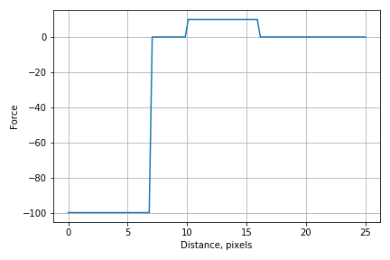
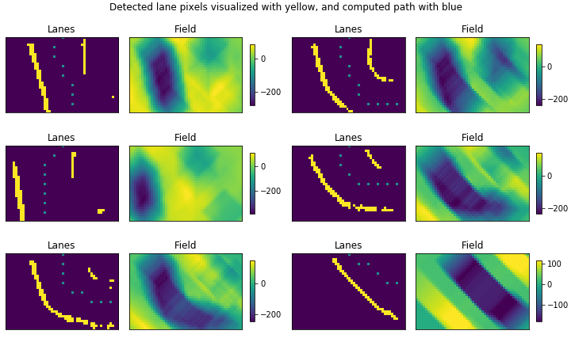
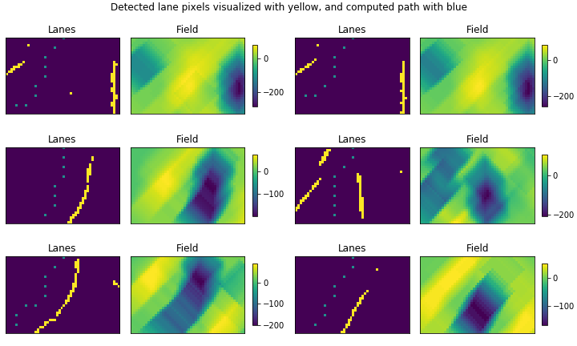

# Autonomous RC car

Drive on a track using semantic segmentation to find lanes.

- [Autonomous RC car](#autonomous-rc-car)
  - [Description](#description)
  - [Hardware setup](#hardware-setup)
  - [Camera settings](#camera-settings)
  - [Birdeye view transform](#birdeye-view-transform)
  - [Lane detection](#lane-detection)
  - [Computing a path based on lane pixels](#computing-a-path-based-on-lane-pixels)

## Description

Every time a new frame is taken from the camera, it is undistorted and transformed into the birdeye view. It is then processed with a semantic segmentation model to detect pixels that belong to the track lines. Based on this information, a path is computed using a potential field approach. The steering angle is decided based on the path. The throttle is constant, except when a sudden turn is detected. In this situation, the throttle is dropped to 0 for a short period of time.

## Hardware setup

The RC car I use is a standard [donkey car](http://docs.donkeycar.com/guide/build_hardware/), but with Raspberry Pi 4 instead of 3. Additionally, a Google Edge TPU is attached through USB to run the lane segmentation model. The Pi 4 over Pi 3 is important due to two reasons:

- you can power it with through USB-C. I had issues with power starvation under load on Pi 3 when powering with a mobile powerbank through USB
- Pi 3 has USB version 2, which is a bottleneck for transferring images onto the Edge TPU

## Camera settings

In order to reduce motion blur, I set the exposure time of the camera to 10000. The downside of that is that the images are darker. You need to set ISO to the highest value to offset the low exposure time. But still, without a good source of light (i.e. in the evening with natural light, or with a weak artificial light) visibility might not be good enough for sufficient lane detection.

## Birdeye view transform
In order to run the lane detection fast, it must be done on relatively small images. However, if you downsize the original image coming from the camera by a lot, the track lanes that are further away will become indistinguishable in the image. However, if you apply a birdeye view transform beforehead, the close and far away lanes will have (relatively) same width. In that perspective, it is possible to downsize to a small image without losing the lane pixels.

## Lane detection

Lane detection is done using an UNET network, converted for int8 inference and run on the Google Edge TPU. You can find the code for training and converting the network, and the labeled data used to train it here: https://github.com/ikrets/rosdonkey-vision. 

## Computing a path based on lane pixels

[Potential field](https://www.cs.cmu.edu/~motionplanning/lecture/Chap4-Potential-Field_howie.pdf) is a method from robotics, that is used to find a path avoiding obstacles towards a goal. In driving on a track, we want to avoid touching the track lanes. But we also want to stay in the middle of the lane when possible. 

To achieve that, we can assign a force to each lane pixel, that repels on a close distance, attracts on a middle distance, and does not act on a large distance. Here is an example:

When the car is from 0 to 6 pixels close to the pixel, there is a repelling force. On the distance from 7 to 10 pixels, the force 0 -- we want to stay in this region. These numbers are coming from the approximate width of the track divided by two, measured in pixels in the birdeye view perspective. When the car is on the distance of 10 - 16 pixels from the pixel, it is pulled closer. Higher than that, and the pixels does not influence the path of the car in that point.

The path is then a way forward through that field. In the usual potential field problem formulation, the goal is known, so the path is easily computed from the field by always going in the direction of the strongest increase in the field. Here however, we do not know where the goal lies in advance. So there must be some heuristics applied in order to go forward without being stuck circling around an optimum. Here is a visualization of the field produced by lane pixels and a computed path.

The attraction part is nessesary with this method, because the goal is not known in advance. It might be forward, to the left, or to the right. Furthermore, the lane detection may partially fail to detect segments of lanes, so the path finding must be somewhat robust to that. Here is an example of fields generated on poor lane detections.

